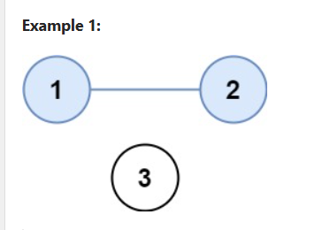

NO OF PROVINCE

This question is very similar to connected component in undirected graph.
I did that question first, created Adjacency list but why?
so when i run my DFS call, i can know who all are my neighbours.
It was easier for me to think through the solution but oh boy, while writing the code i definitely needed some help.

Create Adjacency list 

Find out the total no of cities

iterate through the city, check if it has been visited

if no, call DFS 

In DFS, first mark the city as visited and visit its neighbour and mark them all visited

DFS function done(very simple)

Now no of DFS call will be No of component, but why? see below Diagram 

2 DFS call - 2 province 

yayyyyy

SURROUNDING REGIONS:
refer to my notion notebook

COUNT SUBISLANDS

very similar to Number of closed Island

Start DFS call and count the island and check if it is closed

for checking closed condition, I have kept a boolean and i am checking if in grid1, its 1.